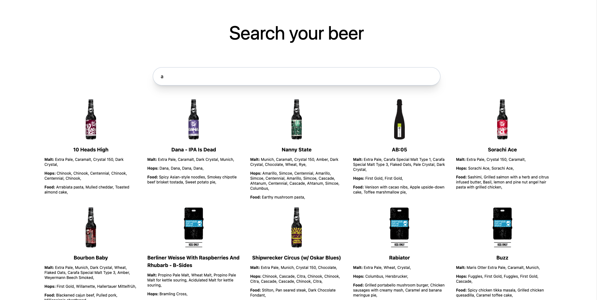
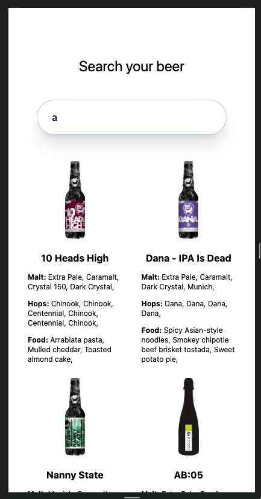

# Prueba con PunkAPI
Este es un proyecto de Angular que te permite consultar una API de cervezas y filtrar los resultados por varios parámetros, como el nombre de la cerveza o los ingredientes. Además, el proyecto utiliza Tailwind CSS para el diseño, lo que garantiza que la aplicación sea responsive y visualmente atractiva en cualquier dispositivo.

## Funcionalidades
Consulta de un listado de cervezas filtrando por nombre e ingredientes.
Diseño responsive gracias a Tailwind CSS.
Detalles de cada cerveza, incluyendo información relevante.

## Capturas de Pantalla

## Requisitos
Antes de comenzar, asegúrate de tener instalados los siguientes componentes:

* Node.js: Descargar e instalar Node.js
* Angular CLI: Instala el CLI de Angular globalmente usando el siguiente comando:

`npm install -g @angular/cli`

## Instalación
Clona este repositorio en tu máquina local:

`git clone https://github.com/sheyla1996/punk-api-o2o.git`

Navega a la carpeta del proyecto:

`cd punk-api-o2o`

Instala las dependencias del proyecto:

`npm install`

## Uso
Inicia la aplicación Angular:

`npm run start`

Abre tu navegador web y visita http://localhost:4200/ para ver la aplicación en funcionamiento.

